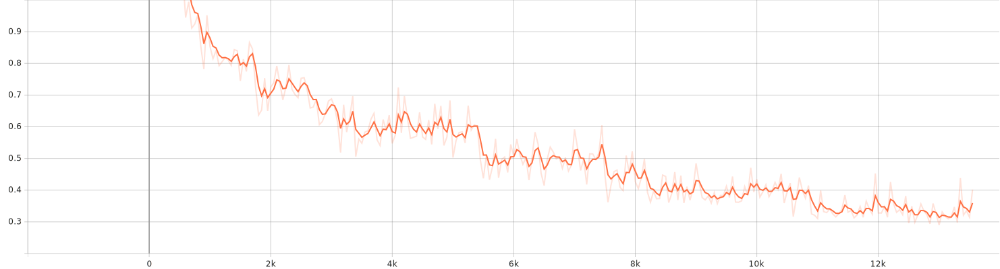
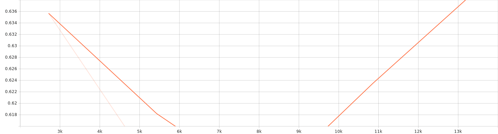

# Multi‑Label Emotion Classification on Reddit Comments

> Fine‑tune transformer models on **GoEmotions** (58k Reddit comments, 27 emotions + neutral) with a clean, reproducible multi‑label pipeline: robust preprocessing, threshold tuning, strong metrics, and a tiny inference CLI.

<p align="center">
  
</p>

**Highlights**

- 📦 **Batteries‑included pipeline**: dataset loading, tokenization, training, evaluation, threshold tuning, and inference CLI.
- 🤗 **Transformers-native**: uses `AutoTokenizer` + `AutoModelForSequenceClassification` and the HF `Trainer` API.
- 🧪 **Multi‑label metrics that matter**: micro/macro/sample F1, micro/macro AP (PR‑AUC), and ROC‑AUC.
- 🎚️ **Decision threshold tuning** on the validation split to maximize micro‑F1.
- ⚙️ **Config‑first**: a single YAML drives the run; sensible defaults provided.
- 🛠️ **Optional PEFT/LoRA** toggles for lightweight finetuning.
- 🚀 **Modern stack**: Python **3.13+**, `transformers`, `datasets`, `accelerate`, `evaluate`, `scikit‑learn`.
---

## 🚀 Model on Hugging Face

[](https://huggingface.co/Amirhossein75/Sequence2Sequence-Transformer-Translation-Opus-MT)

<p align="center">
  <a href="https://huggingface.co/Amirhossein75/Sequence2Sequence-Transformer-Translation-Opus-MT">
    
  </a>
</p>

---

## TL;DR

```bash
# 1) Create env (Python 3.13+) & install deps
python -m venv .venv && source .venv/bin/activate     # (Windows) .venv\Scripts\activate
pip install -r requirements.txt

# 2) Train on GoEmotions with defaults (RoBERTa‑base, 5 epochs)
make train
# equivalent:
python -m emoclass.train --config configs/base.yaml

# 3) Run quick predictions from the saved checkpoint
make infer
# equivalent:
python -m emoclass.inference \
  --model_dir outputs/goemotions_roberta \
  --text "I love this!" "This is awful."
```

> ✅ Example test‑set results (from `results.txt`) for the default config:
>
> **F1 (micro)** 0.528 **|** **F1 (macro)** 0.500 **|** **F1 (samples)** 0.530  
> **AP (micro)** 0.535 **|** **AP (macro)** 0.509 **|** **ROC‑AUC (micro)** 0.952 **|** **ROC‑AUC (macro)** 0.931  
> Tuned threshold ≈ **0.84**

> Artifacts are written to `outputs/goemotions_roberta/` (checkpoints, label names, tuned threshold, TensorBoard logs).

---

## Project structure

```
.
├── configs/
│   └── base.yaml           # All training knobs (dataset/model/optimizer/LoRA/threshold grid/logging)
├── src/
│   ├── __init__.py
│   ├── config.py           # Dataclass + YAML/JSON loader for TrainConfig
│   ├── data.py             # HF datasets loader + tokenization + multi‑hot label encoding
│   ├── metrics.py          # F1 / AP / ROC‑AUC with a fixed decision threshold
│   ├── threshold.py        # Grid search for best threshold on the validation split
│   ├── modeling.py         # Model factory (BCE/Focal, LoRA wiring)
│   ├── train.py            # End‑to‑end training loop using HF Trainer
│   ├── inference.py        # Tiny CLI for batch or inline predictions
│   └── utils.py
├──sagemaker/
│   ├─ entrypoint/
│   │  ├─ train.py          # training script (reads SageMaker channels; or use --use_hf_goemotions)
│   │  └─ inference.py      # custom inference handler (model_fn/input_fn/predict_fn/output_fn)
│   ├─ requirements.txt     # extra pip deps installed in the training/inference container
│   ├─ deploy/
│      └─ train_and_deploy.py  # starts a training job and (optionally) deploys a real-time endpoint
├── Makefile                # make train | make infer | make test | make lint
├── requirements.txt        # runtime dependencies
├── pyproject.toml          # Python >=3.13 + dependency spec
├── results.txt             # Latest run logs & summary metrics
└── outputs/
    └── goemotions_roberta/ # Saved model + logs (created after training)
```

---

## Installation

> **Python**: this repo targets **Python ≥ 3.13** (see `pyproject.toml`). If you’re on an older version, consider `pyenv` or a container.

### Option A — pip (recommended)

```bash
python -m venv .venv && source .venv/bin/activate     # Windows: .venv\Scripts\activate
pip install --upgrade pip
pip install -r requirements.txt
```

### Option B — uv (super fast resolver, optional)

If you use [uv](https://github.com/astral-sh/uv):

```bash
uv venv && source .venv/bin/activate
uv pip install -r requirements.txt
# or, if you prefer syncing from pyproject:
# uv sync
```

> **Dev tools (optional):** for linting and tests you may want `ruff` and `pytest`:
> ```bash
> pip install ruff pytest
> make lint && make test
> ```

---

## Dataset: GoEmotions

- Defaults point to the **`go_emotions`** dataset with the **`simplified`** config (train/validation/test splits, text + labels).
- Labels are **multi‑label** over **27 fine‑grained emotions** (plus neutral). See references below if you’re new to GoEmotions.

You don’t have to download anything manually; the loader will pull the dataset via 🤗 Datasets on first run.

**How labels are represented**  
During preprocessing, integer label lists are turned into **multi‑hot** vectors (float32) for BCE/Focal losses.

---

## Configuration (all in `configs/base.yaml`)

Key fields you can tweak:

```yaml
# Data
dataset_name: go_emotions           # any HF datasets ID
dataset_config: simplified          # raw | simplified | ekman
text_column: text
labels_column: labels
max_length: 192

# Model & optimization
model_name: roberta-base
batch_size: 16
eval_batch_size: 32
lr: 2.0e-5
epochs: 5
weight_decay: 0.01
warmup_ratio: 0.06
grad_accum: 1
gradient_checkpointing: false

# Precision & device
use_bf16_if_available: true         # will auto‑select bf16/fp16 if the hardware supports it
use_fp16_if_available: true

# PEFT / LoRA (optional)
lora: false
lora_r: 8
lora_alpha: 16
lora_dropout: 0.05
lora_target_modules: ["query", "value"]

# Loss
loss_type: "bce"                    # "bce" | "focal"
focal_gamma: 2.0
focal_alpha: 0.25

# Threshold tuning
threshold_grid:
  start: 0.05
  stop: 0.95
  step: 0.01

# Misc
eval_every_steps: 0                 # 0 = evaluate each epoch
save_total_limit: 2
log_level: INFO
output_dir: outputs/goemotions_roberta
seed: 42
```

---

## Training

### One‑liner

```bash
make train
# internally runs: python -m emoclass.train --config configs/base.yaml
```

### Common tweaks

```bash
# change model
python -m emoclass.train --config configs/base.yaml model_name=roberta-large

# turn on LoRA
python -m emoclass.train --config configs/base.yaml lora=true lora_target_modules='["query","value","key"]'

# longer training, larger context
python -m emoclass.train --config configs/base.yaml epochs=8 max_length=256
```

> After each training run, the script automatically **tunes a single global threshold** on the validation set (grid search) and then evaluates on test with that threshold. The chosen threshold and label names are saved alongside the checkpoint for later inference.

### Logging & dashboards

TensorBoard logs are written under `outputs/.../logs`:

```bash
tensorboard --logdir outputs/goemotions_roberta/logs --port 6006
```

---

## Inference

Use the tiny CLI to classify ad‑hoc texts, or batch from a file:

```bash
# Inline texts
python -m emoclass.inference --model_dir outputs/goemotions_roberta \
  --text "Thanks so much, this made my day." \
        "I'm worried this will fail."

# From a newline‑delimited file
python -m emoclass.inference --model_dir outputs/goemotions_roberta \
  --file path/to/sentences.txt

# Override the tuned threshold (optional)
python -m emoclass.inference --model_dir outputs/goemotions_roberta --threshold 0.7 --text "..." 
```

Each line of output is a JSON object containing the predicted labels (and probabilities), e.g.

```json
{"text": "Thanks so much, this made my day.", "predicted": ["gratitude", "joy"], "probs": {"gratitude": 0.93, "joy": 0.71, "...": 0.02}}
```

---

# 📊 Multi‑Label Classification — Experiment Report

[](#)
[](#)
[-0.528-blue?style=for-the-badge)](#)
[-0.952-blue?style=for-the-badge)](#)

> **Run ID / Artifacts**: `outputs/goemotions_roberta`  
> **Task**: Multi‑label classification (threshold‑based).  
> **Decision rule**: Predict positive if `p ≥ 0.840` (threshold tuned on validation to maximize micro‑F1).

---

## 🔎 TL;DR

- **Separation is strong**: ROC‑AUC (micro) ≈ **0.952** on test, indicating the model ranks positives well.  
- **Operational F1**: Test **F1‑micro = 0.528**, **F1‑macro = 0.500** at the tuned threshold **0.840**.  
- **Throughput**: Train ~**315.237** samples/s; Eval ~**1728.233** samples/s.

---

## 🧪 Results

### Validation (post‑epoch 5)
| Metric | Score |
|---|---:|
| Loss | **0.662** |
| F1 (micro) | **0.474** |
| F1 (macro) | **0.423** |
| F1 (samples) | **0.524** |
| AP (micro) | **0.541** |
| AP (macro) | **0.513** |
| ROC‑AUC (micro) | **0.950** |
| ROC‑AUC (macro) | **0.935** |
| Runtime | 3.140 s |
| Throughput | ~1728.233 samples/s |

### Test (threshold = **0.840**)

| Metric | Score |
|---|---:|
| F1 (micro) | **0.528** |
| F1 (macro) | **0.500** |
| F1 (samples) | **0.530** |
| AP (micro) | **0.535** |
| AP (macro) | **0.509** |
| ROC‑AUC (micro) | **0.952** |
| ROC‑AUC (macro) | **0.931** |
---
### 📉 Loss Curve

The following plot shows the training loss progression:




The following plot shows the validation loss progression:



*(SVG file generated during training(by tensorboard logs) and stored under `assets/`)*

## 🖥️ Training Hardware & Environment

- **Device:** Laptop (Windows, WDDM driver model)  
- **GPU:** NVIDIA GeForce **RTX 3080 Ti Laptop GPU** (16 GB VRAM)  
- **Driver:** **576.52**  
- **CUDA (driver):** **12.9**  
- **PyTorch:** **2.8.0+cu129**  
- **CUDA available:** ✅ 

[goemotions_roberta](outputs/goemotions_roberta)
## 📊 Training Logs & Metrics

- **Total FLOPs (training):** `4,179,203,700,293,632`  
- **Training runtime:** `641.2825` seconds  
- **Logging:** TensorBoard-compatible logs in `outputs/goemotions_roberta/logs`  

You can monitor training live with:

```bash
tensorboard --logdir src/outputs/mt_en_es_marian/logs
```
---
## Results (reproducible baseline)

The latest **test‑set** metrics with the default config (`roberta-base`, 5 epochs) are summarized below:

- **F1 (micro)**: **0.5284**
- **F1 (macro)**: **0.4995**
- **F1 (samples)**: **0.5301**
- **Average Precision (micro)**: **0.5352**
- **Average Precision (macro)**: **0.5087**
- **ROC‑AUC (micro)**: **0.9517**
- **ROC‑AUC (macro)**: **0.9310**
- **Tuned threshold**: **0.84**

See the full log in [`results.txt`](results.txt).

---

## How it works (under the hood)

- **Data** – Loaded with 🤗 Datasets; text is tokenized; label lists are mapped to **multi‑hot** vectors.
- **Model** – `AutoModelForSequenceClassification` with `num_labels = 28` (27 emotions + neutral) and **sigmoid** activation at inference.
- **Loss** – Binary cross‑entropy by default; **Focal** loss available for rare classes.
- **Metrics** – Implemented in `src/metrics.py`, computed from raw logits via sigmoid + a **fixed threshold**.
- **Threshold tuning** – `src/threshold.py` sweeps a grid on the **validation split**, picks the threshold that maximizes **micro‑F1**, then evaluates on test.
- **PEFT / LoRA** – If enabled, adapters are injected into attention modules to cut VRAM and training time while preserving accuracy.
- **Reproducibility** – Seeds, deterministic dataloaders where possible, and config snapshots saved with artifacts.

---

## Tips & troubleshooting

- If you hit out‑of‑memory, try `eval_batch_size=16`, `batch_size=8`, and/or enable `gradient_checkpointing`.
- Class imbalance is real in GoEmotions. Consider **Focal loss**, **class‑wise thresholds**, or **re‑weighting** if you optimize for macro metrics.
- Mixed precision:
  - Prefer **bf16** on Ampere+ GPUs if available; otherwise fp16.
  - On CPU‑only, set both `use_bf16_if_available` and `use_fp16_if_available` to `false`.
- For reproducible baselines, keep the **validation threshold** fixed when you compare models.

---


# SageMaker: train, deploy, and infer

## Quick start

### 0) Prereqs
- AWS account + IAM role with SageMaker permissions.
- SageMaker Studio/Notebook **or** local machine with `awscli` and `sagemaker` Python SDK.
- (Optional) An S3 bucket to hold training data and outputs.

### 1) Train (GoEmotions by default)
From your repo root:
```bash
python sagemaker/deploy/train_and_deploy.py --use_hf_goemotions --deploy
```

### 2) Train on your own CSVs
Upload CSVs to S3 (must include a `text` column plus either a `labels` column (JSON list or `;`-separated) or one‑hot label columns):
```bash
python sagemaker/deploy/train_and_deploy.py \
  --train_s3 s3://your-bucket/data/train/ \
  --val_s3   s3://your-bucket/data/val/ \
  --deploy
```

### 3) Invoke the endpoint
**Python**
```python
import boto3, json
smr = boto3.client("sagemaker-runtime")
payload = {"inputs": ["I love this!", "This is awful..."], "threshold": 0.5}
resp = smr.invoke_endpoint(
    EndpointName="YOUR-ENDPOINT",
    ContentType="application/json",
    Body=json.dumps(payload)
)
print(resp["Body"].read().decode("utf-8"))
```

**AWS CLI**
```bash
echo '{"inputs":["I love this!","This is awful..."],"threshold":0.5}' > payload.json
aws sagemaker-runtime invoke-endpoint --endpoint-name YOUR-ENDPOINT \
  --content-type application/json --body fileb://payload.json out.json
cat out.json
```

## Roadmap

- [ ] Per‑label adaptive thresholds (isotonic / Platt scaling variants)
- [ ] Class‑wise PR curves & confusion analysis notebook
- [ ] Better long‑tail handling (re‑weighting, focal‑Tversky)
- [ ] Export ONNX / TorchScript and HF Hub model card

---

## References

- **GoEmotions** dataset & paper (ACL 2020):  
  Demszky et al., *GoEmotions: A Dataset of Fine‑Grained Emotions* (58k Reddit comments; 27 emotions + neutral).  
  https://arxiv.org/abs/2005.00547

- Google Research blog overview:  
  https://research.google/blog/goemotions-a-dataset-for-fine-grained-emotion-classification/

- HF Datasets variants & model zoo trained on GoEmotions:  
  https://huggingface.co/datasets/SetFit/go_emotions  
  https://huggingface.co/models?dataset=dataset%3Ago_emotions

---

## Citation

If you use this repository, please cite GoEmotions:

```bibtex
@inproceedings{demszky2020goemotions,
  title        = {GoEmotions: A Dataset of Fine-Grained Emotions},
  author       = {Demszky, Dorottya and Movshovitz-Attias, Dana and Ko, Jeongwoo and Cowen, Alan and Nemade, Gaurav and Ravi, Sujith},
  booktitle    = {Proceedings of the 58th Annual Meeting of the Association for Computational Linguistics},
  year         = {2020}
}
```

---

## License

The original repository does not include a license file at the time of writing. If you plan to use or release artifacts, consider adding an OSI‑approved license (MIT/Apache‑2.0/BSD‑3‑Clause).

---

**Maintainer**: @amirhossein-yousefi  
**Happy finetuning!** 🎉
